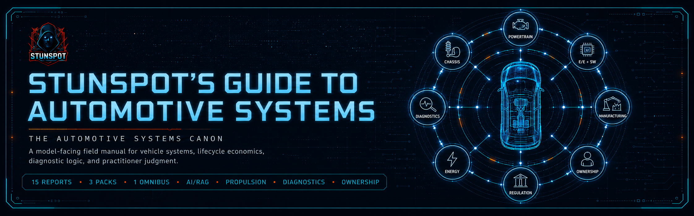

<p align="center">
  
</p>

# Stunspot's Guide to Automotive Systems

**The Automotive Systems Canon**  
*A model-facing field manual for vehicle reality, machine physics, lifecycle economics, failure diagnosis, and practitioner judgment.*


*Stunspot's Guide to Automotive Systems* is a Markdown-native knowledge repository built primarily to support AI-assisted reasoning about vehicles as integrated socio-technical systems.

Its main audience is the model.

When loaded into an AI workspace, RAG pipeline, long-context session, project knowledge base, agent memory layer, or retrieval corpus, the Guide functions as a structured automotive reasoning substrate. It gives the assisting model stable vocabulary, causal frames, diagnostic primitives, system maps, lifecycle economics, repair logic, and practical decision tools for reasoning about automobiles with more precision than consumer advice, enthusiast lore, or isolated technical snippets usually allow.

Human readers can use it as a field manual, but its deeper purpose is practical augmentation: to help AI systems reason through vehicle design, ownership, inspection, repair, modification, regulation, safety, lifecycle cost, and failure analysis without collapsing the automobile into "just a machine," "just a product," or "just a market object."

The canon organizes automotive knowledge around one governing premise:

> A vehicle is a cyber-physical machine embedded in markets, regulations, infrastructure, repair ecosystems, supply chains, cultural narratives, and owner behavior. Automotive judgment improves when the machine, its operating context, and its lifecycle consequences are modeled as one causal system.

Use it as reference material.  
Use it as RAG substrate.  
Use it as project knowledge.  
Use it as doctrine for AI agents tasked with automotive analysis, purchase guidance, maintenance planning, diagnostic reasoning, restoration scoping, modification review, or system-level critique.

---

## Start Here

- [Canon Map](./docs/canon-map.md) — the report sequence and conceptual architecture.
- [How to Use This Canon](./docs/how-to-use-this-canon.md) — practical guidance for humans, AI projects, and RAG workflows.
- [Knowledge Packs](./docs/knowledge-packs.md) — which upload format to use and why.
- [Status](./STATUS.md) — release maturity, corpus shape, and known packaging notes.

---

## Corpus Shape

This release contains:

- **15 source reports** in [`knowledge-packs/by-report/`](./knowledge-packs/by-report/)
- **3 compiled packs** in [`knowledge-packs/compiled-packs/`](./knowledge-packs/compiled-packs/)
- **1 omnibus file** in [`knowledge-packs/omnibus/`](./knowledge-packs/omnibus/)

`docs/` is the navigation and GitHub Pages layer. The individual source-report corpus lives in `knowledge-packs/by-report/`. Compiled upload bundles live in `knowledge-packs/compiled-packs/`. The whole-corpus bundle lives in `knowledge-packs/omnibus/`.

This release includes compiled packs for **A-D**, **E-J**, and **N-O**. Reports **K-M** are present as individual source reports and are included in the omnibus; they are not currently bundled as a separate compiled pack.

---

## What This Canon Covers

The canon runs from **A** through **O**:

- automotive reality modeling: vehicles as machines, assets, legal objects, cultural signals, repair burdens, and infrastructure participants
- physical fundamentals: motion, energy, traction, heat, structure, control, and dimensional reasoning
- architecture: platforms, packaging, modularity, interfaces, hardpoints, and design constraint logic
- evolution: design eras, technology diffusion, industrial change, and cultural meaning
- propulsion: internal combustion, hybrid, electric, fuel, air, thermal management, and drivetrain logic
- chassis and dynamics: suspension, steering, brakes, tires, ride, handling, and road feel
- body, cabin, and human interface: exterior design, interior ergonomics, visibility, comfort, safety space, and meaning
- electrical/electronic/software systems: sensors, networks, ECUs, diagnostics, ADAS, infotainment, cybersecurity, and software-defined vehicles
- manufacturing, supply chain, and quality: factories, suppliers, materials, tolerances, cost structures, and production reality
- ownership and lifecycle economics: buying, selling, depreciation, financing, insurance, maintenance, and residual value
- safety, regulation, and compliance: crashworthiness, emissions, homologation, recalls, liability, and public risk
- energy transition and environmental systems: EV adoption, hybridization, fuels, charging, batteries, emissions, and infrastructure burdens
- performance, motorsport, and modification: speed, durability, rulesets, tuning, aftermarket engineering, and trade-offs
- failure modes and diagnostic logic: breakdowns, wear, noise, leaks, codes, misfires, vibrations, intermittents, and root-cause discipline
- execution artifacts and practitioner workflows: inspections, service plans, buying checklists, restoration maps, build sheets, and decision tools

---

## Who This Is For

This canon is written for model-facing automotive work, especially:

- **AI/RAG builders** creating automotive assistants, retrieval corpora, or project knowledge bases
- **mechanically curious owners** who want better judgment than forum folklore and generic buyer guides
- **technicians, diagnosticians, and service writers** who need sharper causal language for symptoms, tests, repairs, and verification
- **used-car buyers and fleet operators** evaluating risk, duty cycle, lifecycle cost, and repair exposure
- **restoration and modification planners** trying to keep scope, safety, budget, and system balance under control
- **writers, researchers, analysts, and educators** needing a structured map of automotive systems rather than scattered trivia
- **AI agents** tasked with purchase analysis, failure diagnosis, maintenance planning, build critique, market explanation, or automotive system synthesis

---

## How To Use It

Most AI systems should start with the **compiled packs** when file count matters and the **source reports** when citation precision matters.

| Format | Location | Best Use |
|---|---|---|
| **Source reports** | [`knowledge-packs/by-report/`](./knowledge-packs/by-report/) | Precise retrieval, selective upload, citation, auditing, and report-level editing. |
| **Compiled packs** | [`knowledge-packs/compiled-packs/`](./knowledge-packs/compiled-packs/) | Recommended default for many AI projects: fewer files, coherent groupings, strong structure. |
| **Omnibus** | [`knowledge-packs/omnibus/`](./knowledge-packs/omnibus/) | One-file import, archival use, local search, or robust long-context/RAG systems. |

Example model instruction:

> Analyze the automotive question using *Stunspot's Guide to Automotive Systems* as governing reference material. Treat the canon as a systems model, not background reading. Retrieve and apply its vocabulary, causal frames, failure modes, lifecycle economics, diagnostic discipline, and artifact logic. Distinguish symptoms from causes, claims from evidence, components from systems, and ownership lore from measurable duty-cycle reality. When recommending action, make the reasoning testable, repair-aware, cost-aware, safety-aware, and explicit about uncertainty.

See [How to Use This Canon](./docs/how-to-use-this-canon.md) for fuller workflow guidance.

---

## Repository Structure

```text
.
├── README.md
├── LICENSE.md
├── CITATION.cff
├── CHANGELOG.md
├── MANIFEST.md
├── STATUS.md
├── manifest.json
├── docs/
│   ├── index.md
│   ├── canon-map.md
│   ├── how-to-use-this-canon.md
│   ├── knowledge-packs.md
│   ├── _config.yml
│   ├── _layouts/
│   │   └── default.html
│   └── assets/
│       └── css/
│           └── style.css
└── knowledge-packs/
    ├── by-report/
    │   └── 15 source-report Markdown files
    ├── compiled-packs/
    │   └── 3 grouped Markdown upload packs
    └── omnibus/
        └── 1 whole-corpus Markdown bundle
```

The hero and social image paths are intentionally retained as placeholders for later brand assets.

---

## Attribution

Created by **Sam “stunspot” Walker** / **Collaborative Dynamics**.

- [stunspot Prompting Discord server](https://discord.gg/stunspot)
- [Collaborative Dynamics](https://www.collaborative-dynamics.com)

---

## Citation

If you use or reference this canon, please cite it.

See [CITATION.cff](./CITATION.cff) for citation metadata.

Suggested plain-text citation:

> Walker, Sam “stunspot.” *Stunspot's Guide to Automotive Systems: The Automotive Systems Canon*. Collaborative Dynamics, 2026.

---

## License

Unless otherwise stated, this repository is licensed under **Creative Commons Attribution-NonCommercial-ShareAlike 4.0 International** (**CC BY-NC-SA 4.0**).

Commercial use requires prior written permission from Sam “stunspot” Walker / Collaborative Dynamics.

---

## Reliability Note

This corpus was built as an AI-assisted knowledge canon. It is designed for structured reasoning, orientation, model grounding, and decision support, not as a substitute for manufacturer service information, professional inspection, legal advice, regulatory compliance review, or safety-critical repair validation. Verify high-impact claims against primary sources, factory procedures, qualified professionals, and current local law before acting.

--stunspot | ⟨🤩⨯📍⟩ and 💠‍🌐Nova
