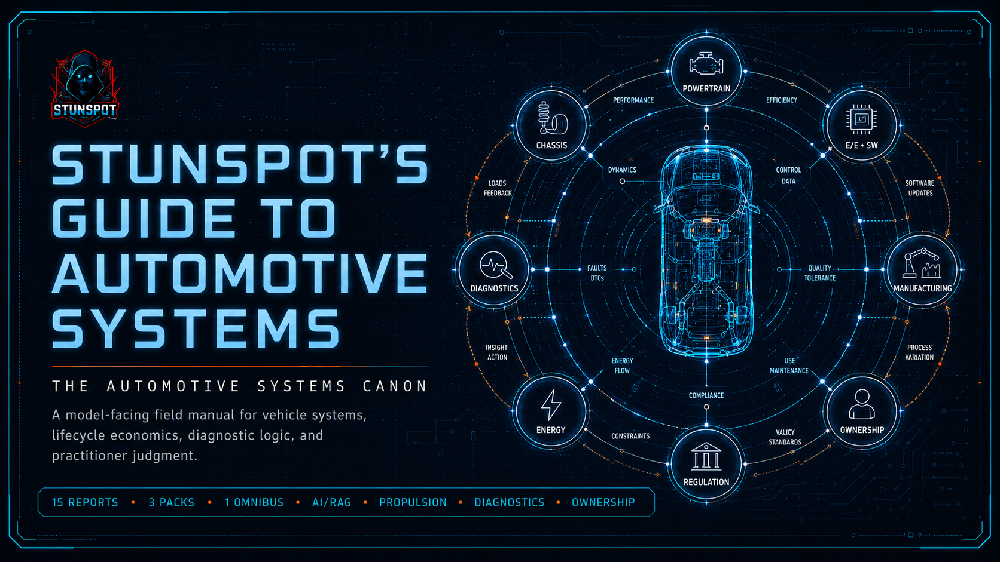

  

# Stunspot's Guide to Automotive Systems

**The Automotive Systems Canon**  
*A model-facing field manual for vehicle reality, machine physics, lifecycle economics, failure diagnosis, and practitioner judgment.*

*Stunspot's Guide to Automotive Systems* is a Markdown-native knowledge repository built primarily to support AI-assisted reasoning about vehicles as integrated socio-technical systems.

Its main audience is the model.

When loaded into an AI workspace, RAG pipeline, long-context session, project knowledge base, agent memory layer, or retrieval corpus, the Guide functions as a structured automotive reasoning substrate. It gives the assisting model stable vocabulary, causal frames, diagnostic primitives, system maps, lifecycle economics, repair logic, and practical decision tools for reasoning about automobiles with more precision than consumer advice, enthusiast lore, or isolated technical snippets usually allow.

The canon treats the automobile as a cyber-physical machine embedded in infrastructure, markets, law, repair labor, ownership behavior, supply chains, culture, and time. That framing matters: most bad automotive reasoning happens when a vehicle is reduced to one layer — horsepower, brand reputation, sticker price, battery chemistry, fault code, or resale value — while the real decision lives in the interaction among all of them.

---

## Start Here

- [Canon Map](./canon-map.md) — the report sequence and conceptual architecture.
- [How to Use This Canon](./how-to-use-this-canon.md) — practical guidance for humans, AI projects, and RAG workflows.
- [Knowledge Packs](./knowledge-packs.md) — source reports, compiled packs, omnibus bundle, and upload recommendations.

---

## Full Canon at a Glance

### Foundations: A-D

The opening reports make the field legible. They define the automobile as a multi-role artifact, then ground later reasoning in physical principles, platform architecture, design constraints, industrial history, and technology diffusion.

### Operating Domains: E-J

The middle reports describe where the real work happens: propulsion, chassis dynamics, body/cabin/interface design, electrical and software systems, manufacturing quality, supply chain reality, ownership economics, and lifecycle cost.

### Institutional and Transition Pressures: K-M

Reports K-M cover the pressures that reshape the vehicle after the engineering drawing is finished: safety law, emissions and homologation, EV adoption, charging and battery burdens, environmental externalities, performance modification, motorsport rulesets, and aftermarket trade-offs.

### Diagnosis and Execution: N-O

The final reports convert the canon into judgment. They distinguish symptoms from causes, codes from diagnoses, and advice from field artifacts. They emphasize reproducible evidence, discriminating tests, repair verification, inspection standards, service plans, build sheets, restoration maps, risk registers, and go/no-go decision tools.

---

## Use as AI Knowledge Substrate

Possible uses include:

- loading selected reports into long-context sessions
- attaching compiled packs as project knowledge
- indexing source reports into a RAG pipeline for precise retrieval and citation
- loading the omnibus into a robust one-file knowledge system
- grounding vehicle purchase analysis, repair planning, ownership risk assessment, and modification critique
- giving AI agents stable automotive vocabulary for parts, systems, symptoms, tests, repair logic, duty cycles, and lifecycle economics
- converting vague automotive questions into measurable constraints, causal hypotheses, and explicit next actions

For best results, load only the portions relevant to the current task, then instruct the model to treat the canon as governing reference material rather than decorative background text.

Example instruction:

> Analyze the automotive question using *Stunspot's Guide to Automotive Systems* as governing reference material. Treat the canon as a systems model, not background reading. Retrieve and apply its vocabulary, causal frames, failure modes, lifecycle economics, diagnostic discipline, and artifact logic. Distinguish symptoms from causes, claims from evidence, components from systems, and ownership lore from measurable duty-cycle reality. When recommending action, make the reasoning testable, repair-aware, cost-aware, safety-aware, and explicit about uncertainty.

---

## Repository Directory Policy

This GitHub Pages site is only the navigation layer.

- `docs/` contains public-facing navigation, guides, layout, CSS, and future brand assets.
- `knowledge-packs/by-report/` contains the 15 canonical individual source reports.
- `knowledge-packs/compiled-packs/` contains grouped upload packs.
- `knowledge-packs/omnibus/` contains the whole-corpus bundle.

There is no `docs/reports/` directory in this repository. Link to the source corpus in `knowledge-packs/by-report/` when citing or inspecting individual reports.

---

## Corpus Shape

- **15 source reports**
- **3 compiled packs**
- **1 omnibus file**
- **Version:** 1.0
- **Released:** 2026-06-28
- **License:** CC BY-NC-SA 4.0
